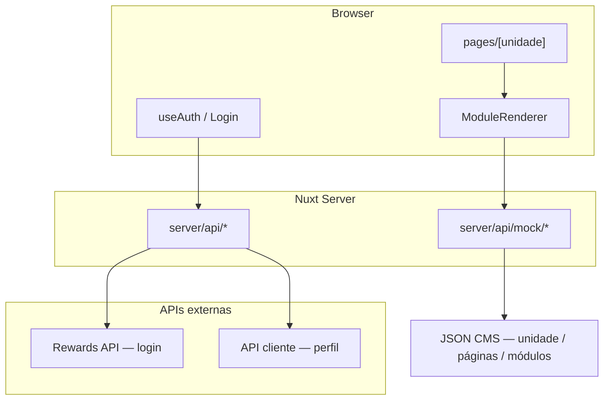

<div align="center">

# H2 Club — Sports Bar & Poker Live

**Site multi-unidade do H2 Club:** páginas CMS-driven, agenda de torneios, ranking, galeria e autenticação — construído com Nuxt 4.

[](https://nuxt.com)
[](https://vuejs.org)
[](https://www.typescriptlang.org)
[](https://tailwindcss.com)
[](#-internacionalização)

<br />


<br />

[Começar](#-quick-start) · [Arquitetura](#-arquitetura) · [Módulos CMS](#-sistema-de-módulos) · [Contribuir](#-contribuindo)

</div>

---

## Sumário

- [Sobre](#-sobre)
- [Features](#-features)
- [Stack](#-stack)
- [Quick Start](#-quick-start)
- [Variáveis de ambiente](#-variáveis-de-ambiente)
- [Arquitetura](#-arquitetura)
- [Sistema de módulos](#-sistema-de-módulos)
- [Estrutura do projeto](#-estrutura-do-projeto)
- [Autenticação](#-autenticação)
- [Internacionalização](#-internacionalização)
- [Scripts](#-scripts)
- [Contribuindo](#-contribuindo)
- [FAQ](#-faq)

---

## Sobre

H2 Club é o front-end do ecossistema **Sports Bar & Poker Live**: cada unidade (clube) recebe páginas montadas a partir de JSON do CMS — banners, agenda, galeria, FAQ, rankings e CTAs — sem hardcode de layout por rota.

O app resolve `/{unidade}` e `/{unidade}/{pagina}`, renderiza módulos tipados via `ModuleRenderer` e integra login com a API de rewards do H2.

---

## Features

| | Capacidade | O que entrega |
|---|---|---|
| **CMS modular** | Páginas e seções via JSON | Novas seções sem criar rotas Vue |
| **Multi-unidade** | Slug por clube | Temas, menu e conteúdo por unidade |
| **Agenda & torneios** | Preview + grid + blinds | Cash game, torneios e detalhe de estrutura |
| **Galeria & banners** | Carrosséis e layouts overlay | Bleed, drag carousel, CTAs tipados |
| **Ranking** | Cards e tabela | Leaderboards configuráveis pelo CMS |
| **Auth** | Login modal + sessão | Avatar, persistência e API externa |
| **i18n** | 5 idiomas | PT, EN, ES, ZH, JA com detecção de browser |
| **UI moderna** | Nuxt UI + shadcn-vue | Dark/light mode, Tailwind 4 |

---

## Stack

```text
Nuxt 4  ·  Vue 3  ·  TypeScript  ·  Pinia
Tailwind CSS 4  ·  Nuxt UI  ·  shadcn-nuxt  ·  Reka UI
@nuxtjs/i18n  ·  VeeValidate + Zod  ·  Embla Carousel  ·  VueUse
```

---

## Quick Start

Pré-requisito: **Node.js 20+**.

```bash
# 1. Clone
git clone https://github.com/pedro-ruffo/h2-sports-bar-poker.git
cd h2-sports-bar-poker

# 2. Instale
npm install

# 3. Rode
npm run dev
```

Abra [http://localhost:3000](http://localhost:3000) — em geral a home de uma unidade fica em `/{slug}` (ex.: `/cph`).

> Sem `.env`, as rotas de mock em `server/api/mock/` cobrem o conteúdo CMS local.

---

## Variáveis de ambiente

Crie um `.env` na raiz (não versionado):

```env
# API Rewards (login)
NUXT_EXTERNAL_API_BASE_RW=https://rewards.h2club.com.br

# API cliente / perfil
NUXT_EXTERNAL_API_BASE_PLU=https://sua-api-plu.exemplo.com
```

| Variável | Uso |
|---|---|
| `NUXT_EXTERNAL_API_BASE_RW` | Base da API de login (`server/api/login.post.ts`) |
| `NUXT_EXTERNAL_API_BASE_PLU` | Base da API de cliente (`server/api/users.get.ts`) |

Definidas em `nuxt.config.ts` → `runtimeConfig`.

---

## Arquitetura



**Fluxo de página**

1. Rota `/{unidade}` ou `/{unidade}/{pagina}`
2. `useUnidadePagina` seleciona a página no JSON (`slug === 'home'` ou slug da URL)
3. `ModuleRenderer` despacha cada `modulo.tipo` para o `*Module.vue` correspondente
4. Cada módulo lê itens via `useModuloComponents(() => props.modulo)`

---

## Sistema de módulos

Hierarquia do CMS:

```text
unidade
├── menu[]              → Header
├── footer?
└── paginas[]
    ├── slug: "home"    → /{unidade}
    ├── slug: "agenda"  → /{unidade}/agenda
    └── modulos[]
        └── components[]   (banner, card, imagem, faq_categoria, …)
```

### Módulos disponíveis

| `tipo` | Uso |
|---|---|
| `banner` | Hero / carrossel de banners |
| `agenda_preview` | Widget de agenda na home |
| `grid` | Agenda completa (`/agenda`) |
| `galeria` / `galeria_preview` | Galeria e preview com bleed |
| `ranking` / `ranking_tabela` | Rankings |
| `faq` / `faq_page` | FAQ embutido ou página |
| `documento_page` | Regulamentos / privacidade |
| `eventos` / `embaixadores` | Eventos e embaixadores |
| `faixa_cta` / `texto` / `download_app` | CTAs, texto e app |

### Checklist — novo módulo

1. Types em `app/types/modules.ts`
2. `XxxModule.vue` + `useModuloComponents`
3. Registrar em `ModuleRenderer.vue`
4. Incluir no mock JSON (`server/api/mock/...`)

Detalhes no guia interno: `.cursor/rules/modules-system.mdc`.

---

## Estrutura do projeto

```text
app/
├── components/
│   ├── modules/          # Banner, Grid, Galeria, FAQ, Ranking…
│   ├── auth/             # Login, avatar
│   ├── layout/           # Header, footer
│   ├── cards/            # Cards de torneio / cash game
│   └── ui/               # shadcn-vue
├── composables/          # useAuth, useUnidadePagina, useGridModule…
├── pages/
│   ├── [unidade]/       # Home + páginas CMS + torneios
│   └── perfil.vue
├── stores/               # Pinia
└── types/                # Contratos CMS tipados
server/
├── api/                  # login, users
└── api/mock/             # Conteúdo CMS local
i18n/locales/             # pt, en, es, zh, ja
public/img/               # Assets estáticos
scripts/                  # Auditorias (ex.: i18n gaps)
```

---

## Autenticação

1. Clique em **Login** no header
2. Credenciais validadas via `POST /api/login` → API Rewards
3. Sessão em estado reativo (`useAuth`) + `localStorage`
4. Header troca o botão pelo avatar; logout limpa a sessão

Composables e componentes principais:

- `app/composables/useAuth.ts`
- `app/components/auth/`
- `server/api/login.post.ts` / `server/api/users.get.ts`

---

## Internacionalização

Estratégia `no_prefix` com cookie de preferência. Locales em `i18n/locales/`:

| Código | Idioma |
|---|---|
| `pt` | Português (padrão) |
| `en` | English |
| `es` | Español |
| `zh` | 中文 |
| `ja` | 日本語 |

Auditoria de gaps CMS ↔ i18n:

```bash
npx tsx scripts/audit-cms-i18n-gaps.ts
```

---

## Scripts

| Comando | Descrição |
|---|---|
| `npm run dev` | Servidor de desenvolvimento |
| `npm run build` | Build de produção |
| `npm run preview` | Preview do build |
| `npm run generate` | Geração estática (quando aplicável) |

---

## Contribuindo

Contribuições são bem-vindas. O fluxo completo está em **[CONTRIBUTING.md](./CONTRIBUTING.md)**.

Resumo:

```bash
# 1. Fork + clone
# 2. Branch
git checkout -b feat/minha-feature

# 3. Desenvolva e rode localmente
npm run dev

# 4. Commit (mensagens claras, em PT ou EN)
git commit -m "feat: adiciona módulo X"

# 5. Abra um Pull Request
```

**Bom primeiro PR:** tipos de módulo, mocks CMS, i18n, acessibilidade ou polish de UI.

Antes de abrir o PR:

- [ ] `npm run build` passa
- [ ] Sem segredos no commit (`.env` fica fora do git)
- [ ] Novos módulos tipados + registrados no `ModuleRenderer`
- [ ] Copy/i18n atualizados se houver texto de UI

---

## FAQ

<details>
<summary><strong>Qual URL usar no dev?</strong></summary>

Use o slug de uma unidade do mock, por exemplo `http://localhost:3000/cph`. Páginas CMS: `/cph/agenda`, `/cph/faq`, etc.
</details>

<details>
<summary><strong>Onde fica o conteúdo das páginas?</strong></summary>

No mock local: `server/api/mock/unidade/[slug]/modulos.get.ts` (e payloads relacionados). Em produção, o CMS alimenta a mesma forma de JSON.
</details>

<details>
<summary><strong>Como adiciono uma seção nova na home?</strong></summary>

Siga o checklist de módulos: types → componente Vue → `ModuleRenderer` → entrada no JSON da página `home`.
</details>

<details>
<summary><strong>Login não funciona sem .env?</strong></summary>

Sim — o login depende de `NUXT_EXTERNAL_API_BASE_RW`. O restante do site (CMS mock) funciona sem as variáveis.
</details>

---

<div align="center">

**H2 Club** — Poker Live · Sports Bar · Rewards

[⬆ Voltar ao topo](#h2-club--sports-bar--poker-live)

</div>
